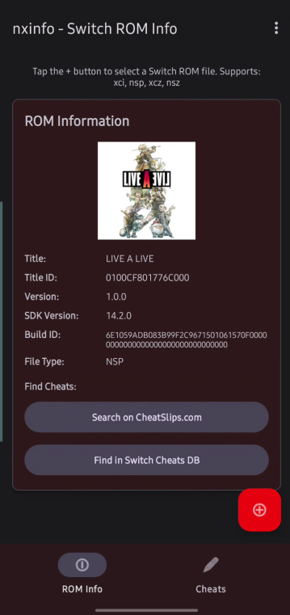
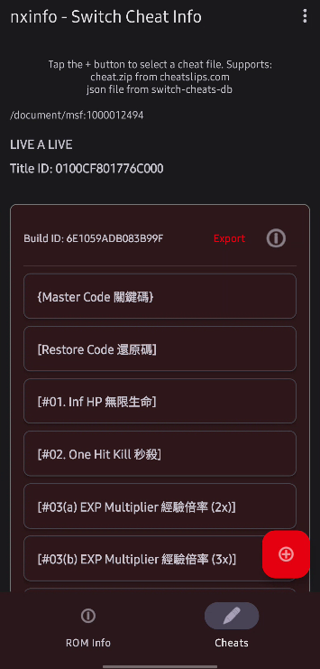
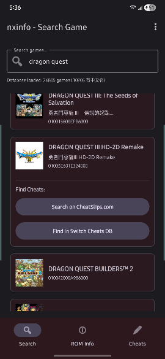

# nxinfo

A simple android app that parses switch nsp, xci files and display the files' meta data.

It can also search for cheat file and export them into mods/cheats folder structure that the Citron/Eden emulator on android can load. 

# Info

From time to time, I need to figure out the build ids of a switch game so that I can download the right mods/cheats for the game. (https://www.cheatslips.com/)
I have found that Ryujinx emulator https://ryujinx.app/ and NxFileViewer https://github.com/Myster-Tee/NxFileViewer can parse and display the build ids but neither of them are available on android.

Often times I play switch games on my android tablets and I got tired of copying the switch files over to a computer just to figure out the build id, so I created this app for myself.

If you have similar needs for android, feel free to take the codes and/or the apk and do whatever you want with it.

Download apk [https://github.com/jayl-dev/nxinfo/releases/latest/download/nxinfo.apk]

# Credits

The app uses modified c++ codes from https://github.com/jakcron/nstool and various open sourced libraries to parse the switch files.

https://github.com/jakcron/libmbedtls.git

https://github.com/jakcron/libfmt.git

https://github.com/jakcron/libtoolchain.git

https://github.com/jakcron/liblz4.git

https://github.com/jakcron/libpietendo.git

Most of the android UI codes are generated because AI can write much faster than I can :) 
